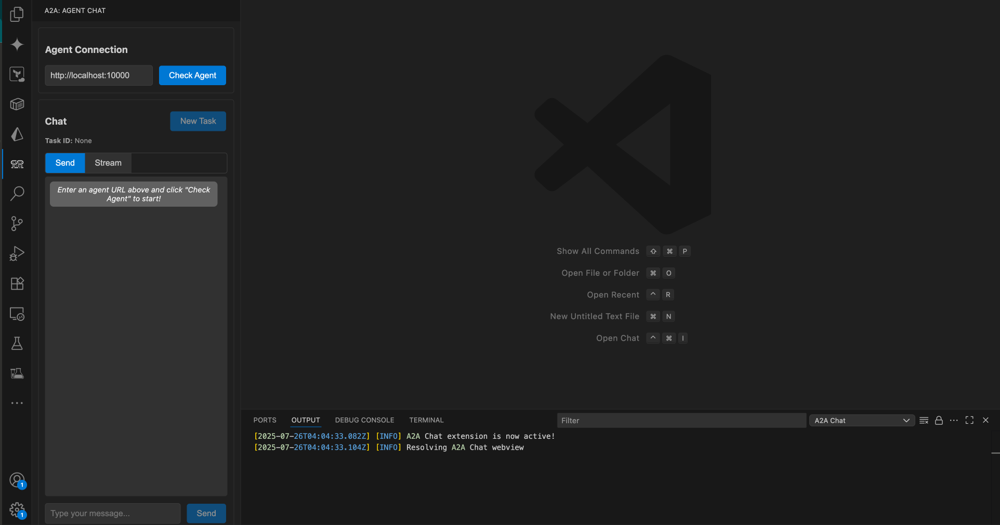

# A2A Agent Client for VSCode

A Visual Studio Code extension that enables debugging Agent-to-Agent (A2A) protocol compatible agents directly within your development environment.




## 🚀 Quick Start

1. **Install the Extension**

   - Download from VSCode Marketplace
   - Or clone and build locally

2. **Connect to an Agent**

   - Open the A2A Chat panel from the activity bar
   - Enter your agent URL (e.g., `http://localhost:10000`)
   - Click "Check Agent" to establish connection

3. **Start Chatting**
   - Type your message in the input field
   - Choose between single-shot or streaming responses
   - View agent capabilities and suggested prompts

## 📋 Local Requirements

- **VSCode**: Version 1.74.0 or higher
- **A2A Agent**: A running agent that implements the A2A protocol

## 🔧 Installation

### From Marketplace

```bash
code --install-extension a2a-client
```

### Manual Installation

```bash
# Clone the repository
git clone https://github.com/rynmccrmck/a2a-vscode-client.git
cd a2a-vscode-client

# Install dependencies and compile
npm install
npm run compile

# Package the extension (optional)
npm install -g vsce
vsce package
```

## 🎯 Usage

### Basic Chat

1. Open the A2A Chat view from the sidebar
2. Enter the agent's base URL
3. Click "Check Agent" to verify connection
4. Start chatting with theyour agent

### Agent Card

The extension automatically fetches agent metadata from the `/.well-known/agent.json` endpoint to display:

- Agent name and version
- Available capabilities (streaming, push notifications)
- Skill definitions with examples
- Connection status

## ⚙️ Configuration

Configure the default agent url for the extension through VSCode settings:

```json
{
  "a2a-chat.agentUrl": "http://localhost:10000"
}
```

## 🤝 Contributing

We welcome contributions! Please see our contributing guidelines:

1. Fork the repository
2. Create a feature branch: `git checkout -b feature/amazing-feature`
3. Commit your changes: `git commit -m 'Add amazing feature'`
4. Push to the branch: `git push origin feature/amazing-feature`
5. Open a Pull Request

### Development Setup

```bash
# Clone and setup
git clone https://github.com/yourusername/a2a-vscode-client.git
cd a2a-vscode-client
npm install

# Start development
npm run compile  # Compile in watch mode
# Press F5 in VSCode to launch Extension Development Host
```

## 📝 A2A Protocol Support

This extension implements the Agent-to-Agent protocol including:

- Agent discovery via `.well-known/agent.json`
- Message sending with `message/send` method
- Streaming responses via `message/stream` method
- Task management
- Status updates and error handling

## 🐛 Troubleshooting

### Common Issues

**Connection Failed**

- Verify your agent is running and accessible
- Check the agent URL format (include protocol: `http://` or `https://`)
- Ensure the agent implements the A2A protocol correctly

**Streaming Not Working**

- Verify your agent supports streaming (`capabilities.streaming: true`)
- Check network connectivity and firewall settings
- Try switching to single-shot mode as fallback

**Agent Card Not Loading**

- Ensure `/.well-known/agent.json` endpoint is available
- Verify JSON format matches A2A specification
- Check VSCode Developer Console for detailed errors

## 📄 License

This project is licensed under the MIT License - see the [LICENSE](LICENCE.txt) file for details.

## 🔗 Related Projects

- [A2A Protocol Specification](https://github.com/a2aproject/A2A)
- [A2A SDK JS](https://github.com/a2aproject/a2a-js)
- [A2A SDK Python](https://github.com/a2aproject/a2a-python)

## 📞 Support

- Create an issue on GitHub for bugs and feature requests
- Check the VSCode Output panel (A2A Chat) for detailed logs
- Join our community discussions

---
